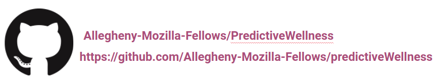

# Predictive Analysis with Health and Wellness Data

Allegheny College Mozilla Fellows

Dr. Jumadinova and Madelyn Kapfhammer

## About Vigor

One in five adults living in the United States use fitness trackers and health-realted apps on a daily basis. With this continuously growing statistic arise ethical concerns of big data collection, and how fitness data can be used. This project will explore and show the impacts of releasing personal data to health and exercise apps. With an artifical intelligence program, students will be able to choose what physical health data is accessible and then see what other medical information can be determined from these small pieces of recorded data. Physical health data will include calorie intake, heart rate, step count, distance walked, minutes of activity, and minutes of rest inlcuding possible other factors. Predicitive analytics will be used in combination with connection to a medical database in the Python programming language for specific medical predictions according to small pieces of information. This tool will allow students to see how health and wellness data can be used, giving them the opportunity to understand and further discuss the ethics of releasing personal information to fitness trackers and health-related applications.

The purpose of this tool is to specifically aid students in having complex conversations about data collection and the ethics surrounding it. Specifically, this tool focuses on the impact of releasing personal health and wellness information. Artifical intelligence is a quickly growing field, raising ethical debates daily. In the case of healthcare, AI is beginning to be used for both diagnostics, and personalized medicine. However, with this growing field, arise concerns related to privacy, informed consent, and patient autonomy. This tool will give students insight into how personal health data can, and often is used, allowing them to form opinions about the ethics surrounding this field. In an artifical intelligence course, one of the most important ideas is to integrate the teaching of ethics, and allow students to form their own opinions about the use and growth of AI. This program will aid in incorporating ethics into courses at Allegheny College.

## Installing Vigor

**1. Clone the Vigor repository onto your machine.**

In the appropriate directory, clone the repository with `git clone` and a following web URL or SSH key.

With HTTPS:

```
git clone https://github.com/Allegheny-Mozilla-Fellows/predictiveWellness.git
```

With SSH Key:

``` 
git clone git@github.com:Allegheny-Mozilla-Fellows/predictiveWellness.git 
```

**2. Install pipenv and dependencies**

The documentation and instructions on installing pipenv can be found [Here.](https://pipenv.kennethreitz.org/en/latest/#install-pipenv-today)

`pipenv` allows dependency installation with ease. After cloning the Vigor repository, install all necessary dependencies for the tool with the command: 

`pipenv install --dev`

## Running Vigor

Vigor is run in a web-based interface aided by [Streamlit](https://github.com/streamlit). For more information on designing web applications with Streamlit, please navigate to their extensive [documentation.](https://www.streamlit.io/)

In the `src` folder of Vigor, run `webInterface.py`, which will navigate to a web tab with the Vigor application.

`cd src`

`streamlit run webInterface.py`

## Questions and Concerns

### Raise an Issue

If you encounter a bug with this tool, have any problems or even have development suggestions, we want to know!

For raising an issue in [Vigor's Issue Tracker](https://github.com/Allegheny-Mozilla-Fellows/predictiveWellness/issues) please use the following templates:

**Reporting a Bug**

Visit [bug_report.md](https://github.com/Allegheny-Mozilla-Fellows/predictiveWellness/blob/master/Development/bug_report.md)

**Requesting a Feature**

Visit [feature_request.md](https://github.com/Allegheny-Mozilla-Fellows/predictiveWellness/blob/master/Development/feature_request.md)

### Contact Us




## Information for Developers

We welcome everyone who is interested in helping improve Vigor! If you are interested in being a contributor, please review our [Code of Conduct](https://github.com/Allegheny-Mozilla-Fellows/predictiveWellness/blob/master/Development/code_of_conduct.md) and [Guidelines for contributors](https://github.com/Allegheny-Mozilla-Fellows/predictiveWellness/blob/master/Development/contributor_guidelines.md) before raising an issue, or beginning a contribution.

To raise an issue please follow these templates:

- [bug_report.md](https://github.com/Allegheny-Mozilla-Fellows/predictiveWellness/blob/master/Development/bug_report.md)

- [feature_request.md](https://github.com/Allegheny-Mozilla-Fellows/predictiveWellness/blob/master/Development/feature_request.md)

To create a pull request please follow this template:

- [pull_request_template.md]


### Create a Pull Request
